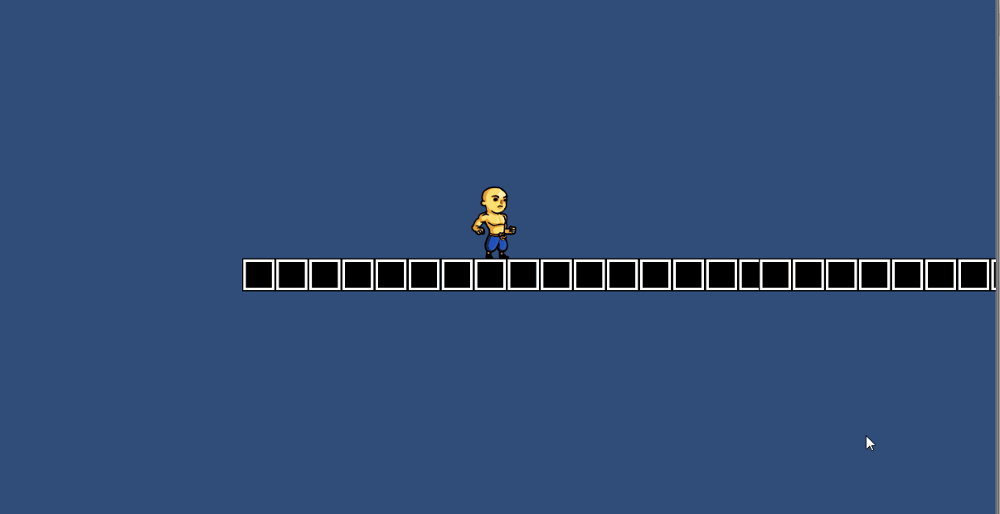

# Monk Runner

Monk runner is a fast paced and skill based 2d platformer game. It's being developed by 3 Game Dev students, @Ryuusukechan, Gregorio Melamud and Albert Torres.

### Why unity?
Well, in our college there is a subject where you learn how to professionally work with unity engine, so this project is going to be part of this subject as well.

### Last Updates

